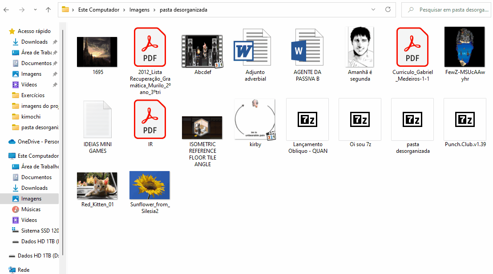
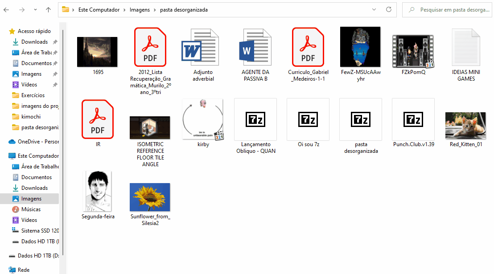

# Organizador de arquivos

Um script simples que permite que você organize uma pasta com base nas extensões específicas (uma pasta para .png, outra para .jpg) ou no tipo de arquivo (Se é vídeo, imagem, arquivo de texto...)

# Organizando por tipo:

# Organizando por extensão:

